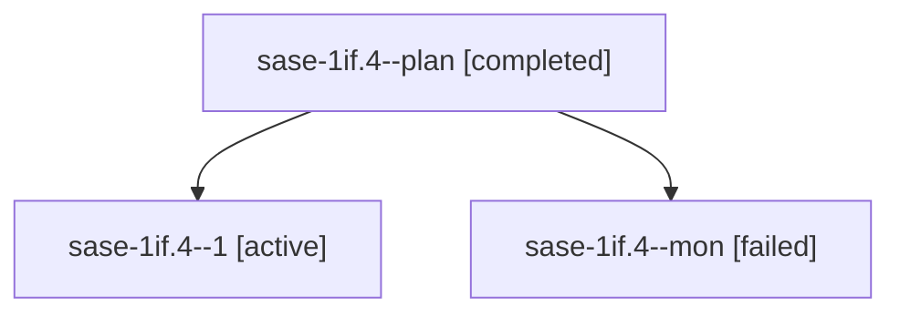

# Session: sase-1if.4

[Agent Hoods](../README.md) / [bbugyi200](../users/bbugyi200/README.md) / [apollo](../users/bbugyi200/machines/apollo/README.md) / [sase-1if](../users/bbugyi200/machines/apollo/hoods/sase-1if/README.md) / sase-1if.4

Owner: `bbugyi200.apollo` · Hood: `sase-1if` · Members: 3 · Bead: [sase-1if.4](https://github.com/sase-org/sase--beads/blob/main/pages/sase-1if/sase-1if.4.md)

## Lineage

The diagram is an optional enhancement; the ordered table below contains the same lineage in accessible text.

| Role | Agent | State | Model / provider | Timing | Commits | Prompt | Chat |
|---|---|---|---|---|---:|---|---|
| plan | sase-1if.4--plan | completed | muse-spark-1.3-contributor / muse | 2026-10-08T20:53:48.420852+00:00 → 2026-10-08T21:36:53.484223+00:00 | 0 | [Prompt](../agents/bbugyi200.apollo.sase-1if.4--plan/prompt.md) | [Chat](../agents/bbugyi200.apollo.sase-1if.4--plan/chat.md) |
| 1 | sase-1if.4--1 | active | muse-spark-1.3-contributor / muse | 2026-10-08T21:53:19.800880+00:00 | [1](../agents/bbugyi200.apollo.sase-1if.4--1/README.md#commits) | [Prompt](../agents/bbugyi200.apollo.sase-1if.4--1/prompt.md) | — |
| mon | sase-1if.4--mon | failed | muse-spark-1.3-contributor / muse | 2026-10-08T21:35:52.832333+00:00 → 2026-10-08T21:53:20.272348+00:00 | 0 | — | [Chat](../agents/bbugyi200.apollo.sase-1if.4--mon/chat.md) |

## Commits

| Role | Repo | Commit | Subject | Committed |
|---|---|---|---|---|
| 1 | sase | [`7922974`](https://github.com/sase-org/sase/commit/79229740620312e2be8412024ece417ca03f1998) | feat(completion): merge plugin parsers into runtime spec with plugin-aware cache identity | 2026-10-08 17:55:41 EDT |

## Neighbors

| Agent | Relation | State |
|---|---|---|
| [sase-1if.1](../agents/bbugyi200.apollo.sase-1if.1/README.md) | sase-1if hood | completed |
| [sase-1if.10](../agents/bbugyi200.apollo.sase-1if.10/README.md) | sase-1if hood | waiting |
| [sase-1if.2](../agents/bbugyi200.apollo.sase-1if.2/README.md) | sase-1if hood | completed |
| [sase-1if.3](../agents/bbugyi200.apollo.sase-1if.3/README.md) | sase-1if hood | active |
| [sase-1if.5](../agents/bbugyi200.apollo.sase-1if.5/README.md) | sase-1if hood | waiting |
| [sase-1if.6](../agents/bbugyi200.apollo.sase-1if.6/README.md) | sase-1if hood | waiting |
| [sase-1if.7](../agents/bbugyi200.apollo.sase-1if.7/README.md) | sase-1if hood | waiting |
| [sase-1if.8](../agents/bbugyi200.apollo.sase-1if.8/README.md) | sase-1if hood | completed |
| [sase-1if.9](../agents/bbugyi200.apollo.sase-1if.9/README.md) | sase-1if hood | completed |
| [sase-1if.land](../agents/bbugyi200.apollo.sase-1if.land/README.md) | sase-1if hood | waiting |
