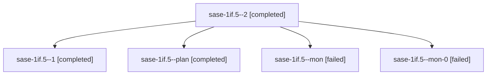

# Session: sase-1if.5

[Agent Hoods](../README.md) / [bbugyi200](../users/bbugyi200/README.md) / [apollo](../users/bbugyi200/machines/apollo/README.md) / [sase-1if](../users/bbugyi200/machines/apollo/hoods/sase-1if/README.md) / sase-1if.5

Owner: `bbugyi200.apollo` · Hood: `sase-1if` · Members: 5 · Bead: [sase-1if.5](https://github.com/sase-org/sase--beads/blob/main/pages/sase-1if/sase-1if.5.md)

## Lineage

The diagram is an optional enhancement; the ordered table below contains the same lineage in accessible text.

| Role | Agent | State | Model / provider | Timing | Commits | Prompt | Chat |
|---|---|---|---|---|---:|---|---|
| 2 | sase-1if.5--2 | completed | muse-spark-1.3-contributor / muse | 2026-10-09T07:06:51.458247+00:00 → 2026-10-09T07:33:38.755145+00:00 | [1](../agents/bbugyi200.apollo.sase-1if.5--2/README.md#commits) | [Prompt](../agents/bbugyi200.apollo.sase-1if.5--2/prompt.md) | [Chat](../agents/bbugyi200.apollo.sase-1if.5--2/chat.md) |
| 1 | sase-1if.5--1 | completed | muse-spark-1.3-contributor / muse | 2026-10-09T05:51:12.285441+00:00 → 2026-10-09T06:07:00.217103+00:00 | 0 | [Prompt](../agents/bbugyi200.apollo.sase-1if.5--1/prompt.md) | [Chat](../agents/bbugyi200.apollo.sase-1if.5--1/chat.md) |
| plan | sase-1if.5--plan | completed | muse-spark-1.3-contributor / muse | 2026-10-09T01:58:40.487867+00:00 → 2026-10-09T04:51:28.032385+00:00 | 0 | [Prompt](../agents/bbugyi200.apollo.sase-1if.5--plan/prompt.md) | [Chat](../agents/bbugyi200.apollo.sase-1if.5--plan/chat.md) |
| mon | sase-1if.5--mon | failed | muse-spark-1.3-contributor / muse | 2026-10-09T04:49:18.458166+00:00 → 2026-10-09T05:50:47.916111+00:00 | 0 | — | [Chat](../agents/bbugyi200.apollo.sase-1if.5--mon/chat.md) |
| mon-0 | sase-1if.5--mon-0 | failed | muse-spark-1.3-contributor / muse | 2026-10-09T06:04:49.027336+00:00 → 2026-10-09T07:06:16.323389+00:00 | 0 | — | [Chat](../agents/bbugyi200.apollo.sase-1if.5--mon-0/chat.md) |

## Commits

| Role | Repo | Commit | Subject | Committed |
|---|---|---|---|---|
| 2 | sase | [`3b3d876`](https://github.com/sase-org/sase/commit/3b3d8769114298c58d8f136c55baaab93a367514) | feat(plugins): command-aware plugin install, update, and uninstall lifecycle | 2026-10-09 03:17:38 EDT |

## Neighbors

| Agent | Relation | State |
|---|---|---|
| [sase-1if.1](../agents/bbugyi200.apollo.sase-1if.1/README.md) | sase-1if hood | completed |
| [sase-1if.10](bbugyi200.apollo.sase-1if.10.md) (session · 3) | sase-1if hood | completed 2, failed 1 |
| [sase-1if.10](../agents/bbugyi200.apollo.sase-1if.10/README.md) | sase-1if hood | waiting |
| [sase-1if.2](../agents/bbugyi200.apollo.sase-1if.2/README.md) | sase-1if hood | completed |
| [sase-1if.3](../agents/bbugyi200.apollo.sase-1if.3/README.md) | sase-1if hood | completed |
| [sase-1if.4](bbugyi200.apollo.sase-1if.4.md) (session · 3) | sase-1if hood | completed 2, failed 1 |
| [sase-1if.6](../agents/bbugyi200.apollo.sase-1if.6/README.md) | sase-1if hood | completed |
| [sase-1if.7](bbugyi200.apollo.sase-1if.7.md) (session · 3) | sase-1if hood | completed 2, failed 1 |
| [sase-1if.7](../agents/bbugyi200.apollo.sase-1if.7/README.md) | sase-1if hood | waiting |
| [sase-1if.8](../agents/bbugyi200.apollo.sase-1if.8/README.md) | sase-1if hood | completed |
| [sase-1if.9](../agents/bbugyi200.apollo.sase-1if.9/README.md) | sase-1if hood | completed |
| [sase-1if.land](../agents/bbugyi200.apollo.sase-1if.land/README.md) | sase-1if hood | active |
