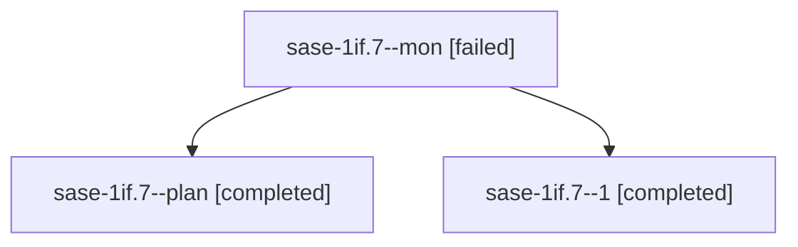

# Session: sase-1if.7

[Agent Hoods](../README.md) / [bbugyi200](../users/bbugyi200/README.md) / [apollo](../users/bbugyi200/machines/apollo/README.md) / [sase-1if](../users/bbugyi200/machines/apollo/hoods/sase-1if/README.md) / sase-1if.7

Owner: `bbugyi200.apollo` · Hood: `sase-1if` · Members: 3 · Bead: [sase-1if.7](https://github.com/sase-org/sase--beads/blob/main/pages/sase-1if/sase-1if.7.md)

## Lineage

The diagram is an optional enhancement; the ordered table below contains the same lineage in accessible text.

| Role | Agent | State | Model / provider | Timing | Commits | Prompt | Chat |
|---|---|---|---|---|---:|---|---|
| mon | sase-1if.7--mon | failed | muse-spark-1.3-contributor / muse | 2026-10-09T15:49:36.471425+00:00 → 2026-10-09T16:50:31.792187+00:00 | 0 | — | [Chat](../agents/bbugyi200.apollo.sase-1if.7--mon/chat.md) |
| plan | sase-1if.7--plan | completed | muse-spark-1.3-contributor / muse | 2026-10-09T15:01:34.667468+00:00 → 2026-10-09T15:50:19.285272+00:00 | 0 | [Prompt](../agents/bbugyi200.apollo.sase-1if.7--plan/prompt.md) | [Chat](../agents/bbugyi200.apollo.sase-1if.7--plan/chat.md) |
| 1 | sase-1if.7--1 | completed | muse-spark-1.3-contributor / muse | 2026-10-09T16:50:31.509077+00:00 → 2026-10-09T17:20:49.504034+00:00 | [1](../agents/bbugyi200.apollo.sase-1if.7--1/README.md#commits) | [Prompt](../agents/bbugyi200.apollo.sase-1if.7--1/prompt.md) | [Chat](../agents/bbugyi200.apollo.sase-1if.7--1/chat.md) |

## Commits

| Role | Repo | Commit | Subject | Committed |
|---|---|---|---|---|
| 1 | sase | [`f0c732e`](https://github.com/sase-org/sase/commit/f0c732e70d07e2849556c487f0ff339b7bc9b984) | feat(sase-1if.7): render plugin commands across Updates tab, detail panel, confirms, and toast | 2026-10-09 13:14:31 EDT |

## Neighbors

| Agent | Relation | State |
|---|---|---|
| [sase-1if.1](../agents/bbugyi200.apollo.sase-1if.1/README.md) | sase-1if hood | completed |
| [sase-1if.10](bbugyi200.apollo.sase-1if.10.md) (session · 3) | sase-1if hood | completed 2, failed 1 |
| [sase-1if.10](../agents/bbugyi200.apollo.sase-1if.10/README.md) | sase-1if hood | waiting |
| [sase-1if.2](../agents/bbugyi200.apollo.sase-1if.2/README.md) | sase-1if hood | completed |
| [sase-1if.3](../agents/bbugyi200.apollo.sase-1if.3/README.md) | sase-1if hood | completed |
| [sase-1if.4](bbugyi200.apollo.sase-1if.4.md) (session · 3) | sase-1if hood | completed 2, failed 1 |
| [sase-1if.5](bbugyi200.apollo.sase-1if.5.md) (session · 5) | sase-1if hood | completed 3, failed 2 |
| [sase-1if.6](../agents/bbugyi200.apollo.sase-1if.6/README.md) | sase-1if hood | completed |
| [sase-1if.8](../agents/bbugyi200.apollo.sase-1if.8/README.md) | sase-1if hood | completed |
| [sase-1if.9](../agents/bbugyi200.apollo.sase-1if.9/README.md) | sase-1if hood | completed |
| [sase-1if.land](../agents/bbugyi200.apollo.sase-1if.land/README.md) | sase-1if hood | active |
