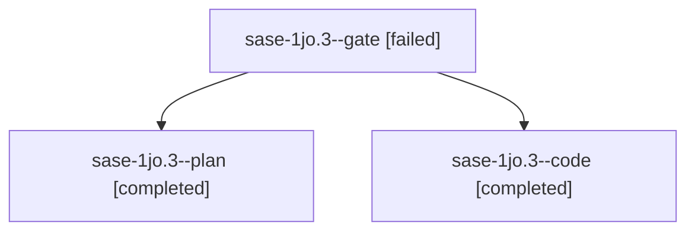

# Session: sase-1jo.3

[Agent Hoods](../README.md) / [bbugyi200](../users/bbugyi200/README.md) / [apollo](../users/bbugyi200/machines/apollo/README.md) / [sase-1jo](../users/bbugyi200/machines/apollo/hoods/sase-1jo/README.md) / sase-1jo.3

Owner: `bbugyi200.apollo` · Hood: `sase-1jo` · Members: 3 · Bead: [sase-1jo.3](https://github.com/sase-org/sase--beads/blob/main/pages/sase-1jo/sase-1jo.3.md)

## Lineage

The diagram is an optional enhancement; the ordered table below contains the same lineage in accessible text.

| Role | Agent | State | Model / provider | Timing | Commits | Prompt | Chat |
|---|---|---|---|---|---:|---|---|
| gate | sase-1jo.3--gate | failed | gpt-6.1-sol / codex | 2026-10-10T19:50:47.288408+00:00 → 2026-10-10T19:51:07.179674+00:00 | 0 | — | [Chat](../agents/bbugyi200.apollo.sase-1jo.3--gate/chat.md) |
| plan | sase-1jo.3--plan | completed | gpt-6.1-sol / codex | 2026-10-10T19:47:07.759279+00:00 → 2026-10-10T19:54:30.083374+00:00 | 0 | [Prompt](../agents/bbugyi200.apollo.sase-1jo.3--plan/prompt.md) | [Chat](../agents/bbugyi200.apollo.sase-1jo.3--plan/chat.md) |
| code | sase-1jo.3--code | completed | gpt-6-luna / codex | 2026-10-10T19:51:36.076297+00:00 → 2026-10-10T19:54:30.083374+00:00 | 0 | — | [Chat](../agents/bbugyi200.apollo.sase-1jo.3--code/chat.md) |

## Neighbors

| Agent | Relation | State |
|---|---|---|
| [sase-1jo.1](../agents/bbugyi200.apollo.sase-1jo.1/README.md) | sase-1jo hood | completed |
| [sase-1jo.2](../agents/bbugyi200.apollo.sase-1jo.2/README.md) | sase-1jo hood | completed |
| [sase-1jo.4](../agents/bbugyi200.apollo.sase-1jo.4/README.md) | sase-1jo hood | active |
| [sase-1jo.land](../agents/bbugyi200.apollo.sase-1jo.land/README.md) | sase-1jo hood | waiting |
