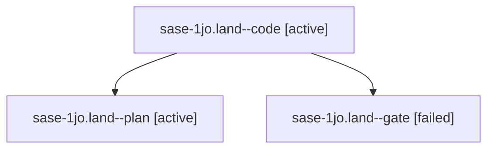

# Session: sase-1jo.land

[Agent Hoods](../README.md) / [bbugyi200](../users/bbugyi200/README.md) / [apollo](../users/bbugyi200/machines/apollo/README.md) / [sase-1jo](../users/bbugyi200/machines/apollo/hoods/sase-1jo/README.md) / sase-1jo.land

Owner: `bbugyi200.apollo` · Hood: `sase-1jo` · Members: 3 · Bead: [sase-1jo](https://github.com/sase-org/sase--beads/blob/main/pages/sase-1jo/README.md)

## Lineage

The diagram is an optional enhancement; the ordered table below contains the same lineage in accessible text.

| Role | Agent | State | Model / provider | Timing | Commits | Prompt | Chat |
|---|---|---|---|---|---:|---|---|
| code | sase-1jo.land--code | active | muse-spark-1.3-contributor / muse | 2026-10-10T20:40:21.434388+00:00 | 0 | — | — |
| plan | sase-1jo.land--plan | active | grok-4.7 / grok | 2026-10-10T20:26:49.609696+00:00 | 0 | [Prompt](../agents/bbugyi200.apollo.sase-1jo.land--plan/prompt.md) | [Chat](../agents/bbugyi200.apollo.sase-1jo.land--plan/chat.md) |
| gate | sase-1jo.land--gate | failed | grok-4.7 / grok | 2026-10-10T20:39:18.763050+00:00 → 2026-10-10T20:39:41.468843+00:00 | 0 | — | [Chat](../agents/bbugyi200.apollo.sase-1jo.land--gate/chat.md) |

## Neighbors

| Agent | Relation | State |
|---|---|---|
| [sase-1jo.1](../agents/bbugyi200.apollo.sase-1jo.1/README.md) | sase-1jo hood | completed |
| [sase-1jo.2](../agents/bbugyi200.apollo.sase-1jo.2/README.md) | sase-1jo hood | completed |
| [sase-1jo.3](bbugyi200.apollo.sase-1jo.3.md) (session · 3) | sase-1jo hood | completed 2, failed 1 |
| [sase-1jo.4](../agents/bbugyi200.apollo.sase-1jo.4/README.md) | sase-1jo hood | completed |
