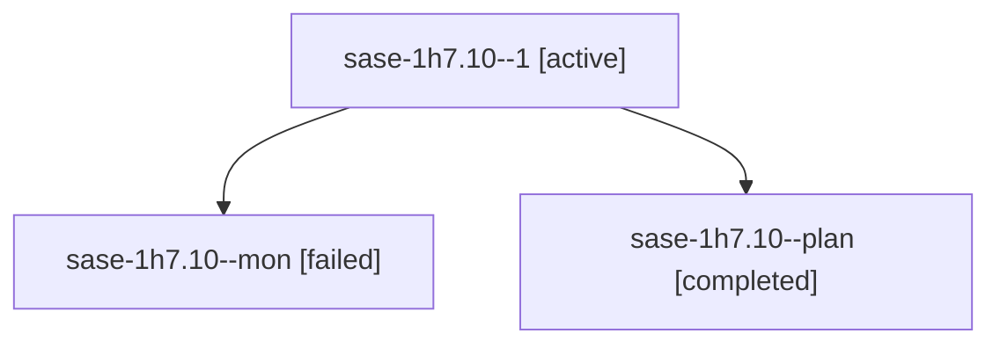

# Session: sase-1h7.10

[Agent Hoods](../README.md) / [bbugyi200](../users/bbugyi200/README.md) / [athena](../users/bbugyi200/machines/athena/README.md) / [sase-1h7](../users/bbugyi200/machines/athena/hoods/sase-1h7/README.md) / sase-1h7.10

Owner: `bbugyi200.athena` · Hood: `sase-1h7` · Members: 3 · Bead: [sase-1h7.10](https://github.com/sase-org/sase--beads/blob/main/pages/sase-1h7/sase-1h7.10.md)

## Lineage

The diagram is an optional enhancement; the ordered table below contains the same lineage in accessible text.

| Role | Agent | State | Model / provider | Timing | Commits | Prompt | Chat |
|---|---|---|---|---|---:|---|---|
| 1 | sase-1h7.10--1 | active | muse-spark-1.3-contributor / muse | 2026-10-08T01:38:05.597093+00:00 | [1](../agents/bbugyi200.athena.sase-1h7.10--1/README.md#commits) | [Prompt](../agents/bbugyi200.athena.sase-1h7.10--1/prompt.md) | — |
| mon | sase-1h7.10--mon | failed | muse-spark-1.3-contributor / muse | 2026-10-08T00:50:15.386690+00:00 → 2026-10-08T01:35:19.904303+00:00 | 0 | — | [Chat](../agents/bbugyi200.athena.sase-1h7.10--mon/chat.md) |
| plan | sase-1h7.10--plan | completed | muse-spark-1.3-contributor / muse | 2026-10-08T00:15:07.502562+00:00 → 2026-10-08T00:51:07.411195+00:00 | 0 | [Prompt](../agents/bbugyi200.athena.sase-1h7.10--plan/prompt.md) | [Chat](../agents/bbugyi200.athena.sase-1h7.10--plan/chat.md) |

## Commits

| Role | Repo | Commit | Subject | Committed |
|---|---|---|---|---|
| 1 | sase | [`c7190fb`](https://github.com/sase-org/sase/commit/c7190fb99a93a71e66dee4f0576e5e67760c5050) | feat(wait): default WAIT\_FOR\_EPIC to true with for\_epic=false phase sequencing | 2026-10-07 21:57:40 EDT |

## Neighbors

| Agent | Relation | State |
|---|---|---|
| [sase-1h7.1](../agents/bbugyi200.athena.sase-1h7.1/README.md) | sase-1h7 hood | completed |
| [sase-1h7.2](../agents/bbugyi200.athena.sase-1h7.2/README.md) | sase-1h7 hood | completed |
| [sase-1h7.3](bbugyi200.athena.sase-1h7.3.md) (session · 3) | sase-1h7 hood | completed 2, failed 1 |
| [sase-1h7.4](bbugyi200.athena.sase-1h7.4.md) (session · 5) | sase-1h7 hood | completed 3, failed 2 |
| [sase-1h7.5](bbugyi200.athena.sase-1h7.5.md) (session · 9) | sase-1h7 hood | completed 5, failed 4 |
| [sase-1h7.6](../agents/bbugyi200.athena.sase-1h7.6/README.md) | sase-1h7 hood | completed |
| [sase-1h7.7](bbugyi200.athena.sase-1h7.7.md) (session · 3) | sase-1h7 hood | completed 2, failed 1 |
| [sase-1h7.8](../agents/bbugyi200.athena.sase-1h7.8/README.md) | sase-1h7 hood | completed |
| [sase-1h7.9](../agents/bbugyi200.athena.sase-1h7.9/README.md) | sase-1h7 hood | completed |
| [sase-1h7.land](../agents/bbugyi200.athena.sase-1h7.land/README.md) | sase-1h7 hood | waiting |
