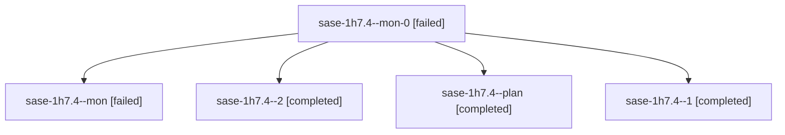

# Session: sase-1h7.4

[Agent Hoods](../README.md) / [bbugyi200](../users/bbugyi200/README.md) / [athena](../users/bbugyi200/machines/athena/README.md) / [sase-1h7](../users/bbugyi200/machines/athena/hoods/sase-1h7/README.md) / sase-1h7.4

Owner: `bbugyi200.athena` · Hood: `sase-1h7` · Members: 5 · Bead: [sase-1h7.4](https://github.com/sase-org/sase--beads/blob/main/pages/sase-1h7/sase-1h7.4.md)

## Lineage

The diagram is an optional enhancement; the ordered table below contains the same lineage in accessible text.

| Role | Agent | State | Model / provider | Timing | Commits | Prompt | Chat |
|---|---|---|---|---|---:|---|---|
| mon-0 | sase-1h7.4--mon-0 | failed | muse-spark-1.3-contributor / muse | 2026-10-07T03:36:03.028593+00:00 → 2026-10-07T04:14:31.143097+00:00 | 0 | — | [Chat](../agents/bbugyi200.athena.sase-1h7.4--mon-0/chat.md) |
| mon | sase-1h7.4--mon | failed | muse-spark-1.3-contributor / muse | 2026-10-07T02:04:51.495327+00:00 → 2026-10-07T02:07:04.045245+00:00 | 0 | — | [Chat](../agents/bbugyi200.athena.sase-1h7.4--mon/chat.md) |
| 2 | sase-1h7.4--2 | completed | muse-spark-1.3-contributor / muse | 2026-10-07T04:15:31.529811+00:00 → 2026-10-07T04:36:17.001133+00:00 | 0 | [Prompt](../agents/bbugyi200.athena.sase-1h7.4--2/prompt.md) | [Chat](../agents/bbugyi200.athena.sase-1h7.4--2/chat.md) |
| plan | sase-1h7.4--plan | completed | muse-spark-1.3-contributor / muse | 2026-10-07T01:13:29.303951+00:00 → 2026-10-07T02:05:28.957612+00:00 | 0 | [Prompt](../agents/bbugyi200.athena.sase-1h7.4--plan/prompt.md) | [Chat](../agents/bbugyi200.athena.sase-1h7.4--plan/chat.md) |
| 1 | sase-1h7.4--1 | completed | muse-spark-1.3-contributor / muse | 2026-10-07T02:07:43.996783+00:00 → 2026-10-07T03:39:48.294011+00:00 | [1](../agents/bbugyi200.athena.sase-1h7.4--1/README.md#commits) | [Prompt](../agents/bbugyi200.athena.sase-1h7.4--1/prompt.md) | [Chat](../agents/bbugyi200.athena.sase-1h7.4--1/chat.md) |

## Commits

| Role | Repo | Commit | Subject | Committed |
|---|---|---|---|---|
| 1 | sase | [`313aa2c`](https://github.com/sase-org/sase/commit/313aa2c9930455835f3c29dd50ff2e279ea6a1f8) | feat(wait): add epic-follow reducer and fact collector (sase-1h7.4) | 2026-10-06 23:29:44 EDT |

## Neighbors

| Agent | Relation | State |
|---|---|---|
| [sase-1h7.1](../agents/bbugyi200.athena.sase-1h7.1/README.md) | sase-1h7 hood | completed |
| [sase-1h7.10](bbugyi200.athena.sase-1h7.10.md) (session · 3) | sase-1h7 hood | active 1, completed 1, failed 1 |
| [sase-1h7.2](../agents/bbugyi200.athena.sase-1h7.2/README.md) | sase-1h7 hood | completed |
| [sase-1h7.3](bbugyi200.athena.sase-1h7.3.md) (session · 3) | sase-1h7 hood | completed 2, failed 1 |
| [sase-1h7.5](bbugyi200.athena.sase-1h7.5.md) (session · 9) | sase-1h7 hood | completed 5, failed 4 |
| [sase-1h7.6](../agents/bbugyi200.athena.sase-1h7.6/README.md) | sase-1h7 hood | completed |
| [sase-1h7.7](bbugyi200.athena.sase-1h7.7.md) (session · 3) | sase-1h7 hood | completed 2, failed 1 |
| [sase-1h7.8](../agents/bbugyi200.athena.sase-1h7.8/README.md) | sase-1h7 hood | completed |
| [sase-1h7.9](../agents/bbugyi200.athena.sase-1h7.9/README.md) | sase-1h7 hood | completed |
| [sase-1h7.land](../agents/bbugyi200.athena.sase-1h7.land/README.md) | sase-1h7 hood | waiting |
