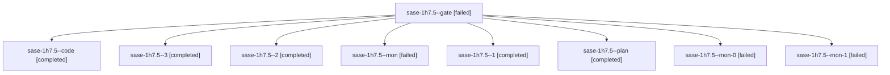

# Session: sase-1h7.5

[Agent Hoods](../README.md) / [bbugyi200](../users/bbugyi200/README.md) / [athena](../users/bbugyi200/machines/athena/README.md) / [sase-1h7](../users/bbugyi200/machines/athena/hoods/sase-1h7/README.md) / sase-1h7.5

Owner: `bbugyi200.athena` · Hood: `sase-1h7` · Members: 9 · Bead: [sase-1h7.5](https://github.com/sase-org/sase--beads/blob/main/pages/sase-1h7/sase-1h7.5.md)

## Lineage

The diagram is an optional enhancement; the ordered table below contains the same lineage in accessible text.

| Role | Agent | State | Model / provider | Timing | Commits | Prompt | Chat |
|---|---|---|---|---|---:|---|---|
| gate | sase-1h7.5--gate | failed | grok-4.7 / grok | 2026-10-07T16:23:36.942398+00:00 → 2026-10-07T16:24:04.589669+00:00 | 0 | — | [Chat](../agents/bbugyi200.athena.sase-1h7.5--gate/chat.md) |
| code | sase-1h7.5--code | completed | muse-spark-1.3-contributor / muse | 2026-10-07T16:24:29.670523+00:00 → 2026-10-07T17:18:59.280992+00:00 | 0 | — | [Chat](../agents/bbugyi200.athena.sase-1h7.5--code/chat.md) |
| 3 | sase-1h7.5--3 | completed | muse-spark-1.3-contributor / muse | 2026-10-07T19:11:42.029455+00:00 → 2026-10-07T20:34:45.390894+00:00 | [1](../agents/bbugyi200.athena.sase-1h7.5--3/README.md#commits) | [Prompt](../agents/bbugyi200.athena.sase-1h7.5--3/prompt.md) | [Chat](../agents/bbugyi200.athena.sase-1h7.5--3/chat.md) |
| 2 | sase-1h7.5--2 | completed | muse-spark-1.3-contributor / muse | 2026-10-07T18:15:23.447643+00:00 → 2026-10-07T18:46:12.745750+00:00 | 0 | [Prompt](../agents/bbugyi200.athena.sase-1h7.5--2/prompt.md) | [Chat](../agents/bbugyi200.athena.sase-1h7.5--2/chat.md) |
| mon | sase-1h7.5--mon | failed | muse-spark-1.3-contributor / muse | 2026-10-07T17:16:55.011575+00:00 → 2026-10-07T17:36:36.589099+00:00 | 0 | — | [Chat](../agents/bbugyi200.athena.sase-1h7.5--mon/chat.md) |
| 1 | sase-1h7.5--1 | completed | muse-spark-1.3-contributor / muse | 2026-10-07T17:37:23.881403+00:00 → 2026-10-07T17:54:10.492176+00:00 | 0 | [Prompt](../agents/bbugyi200.athena.sase-1h7.5--1/prompt.md) | [Chat](../agents/bbugyi200.athena.sase-1h7.5--1/chat.md) |
| plan | sase-1h7.5--plan | completed | grok-4.7 / grok | 2026-10-07T16:10:59.932476+00:00 → 2026-10-07T17:18:59.280992+00:00 | 0 | [Prompt](../agents/bbugyi200.athena.sase-1h7.5--plan/prompt.md) | [Chat](../agents/bbugyi200.athena.sase-1h7.5--plan/chat.md) |
| mon-0 | sase-1h7.5--mon-0 | failed | muse-spark-1.3-contributor / muse | 2026-10-07T17:53:38.372332+00:00 → 2026-10-07T18:14:37.209835+00:00 | 0 | — | [Chat](../agents/bbugyi200.athena.sase-1h7.5--mon-0/chat.md) |
| mon-1 | sase-1h7.5--mon-1 | failed | muse-spark-1.3-contributor / muse | 2026-10-07T18:44:26.959435+00:00 → 2026-10-07T18:51:22.166624+00:00 | 0 | — | [Chat](../agents/bbugyi200.athena.sase-1h7.5--mon-1/chat.md) |

## Commits

| Role | Repo | Commit | Subject | Committed |
|---|---|---|---|---|
| 3 | sase | [`446f183`](https://github.com/sase-org/sase/commit/446f1833deb92962992f7fb9538a82a21f3c0982) | feat(bead): serve list and status queries from indexed read-model tables | 2026-10-07 16:19:41 EDT |
| — | sase | [`333034a`](https://github.com/sase-org/sase/commit/333034a60aa09d6279d508b4d39f0ab9707da912) | feat(wait): route every release path through shared epic-follow release (sase-1h7.5) | 2026-10-07 16:26:49 EDT |

## Neighbors

| Agent | Relation | State |
|---|---|---|
| [sase-1h7.1](../agents/bbugyi200.athena.sase-1h7.1/README.md) | sase-1h7 hood | completed |
| [sase-1h7.10](bbugyi200.athena.sase-1h7.10.md) (session · 3) | sase-1h7 hood | active 1, completed 1, failed 1 |
| [sase-1h7.2](../agents/bbugyi200.athena.sase-1h7.2/README.md) | sase-1h7 hood | completed |
| [sase-1h7.3](bbugyi200.athena.sase-1h7.3.md) (session · 3) | sase-1h7 hood | completed 2, failed 1 |
| [sase-1h7.4](bbugyi200.athena.sase-1h7.4.md) (session · 5) | sase-1h7 hood | completed 3, failed 2 |
| [sase-1h7.6](../agents/bbugyi200.athena.sase-1h7.6/README.md) | sase-1h7 hood | completed |
| [sase-1h7.7](bbugyi200.athena.sase-1h7.7.md) (session · 3) | sase-1h7 hood | completed 2, failed 1 |
| [sase-1h7.8](../agents/bbugyi200.athena.sase-1h7.8/README.md) | sase-1h7 hood | completed |
| [sase-1h7.9](../agents/bbugyi200.athena.sase-1h7.9/README.md) | sase-1h7 hood | completed |
| [sase-1h7.land](../agents/bbugyi200.athena.sase-1h7.land/README.md) | sase-1h7 hood | waiting |
