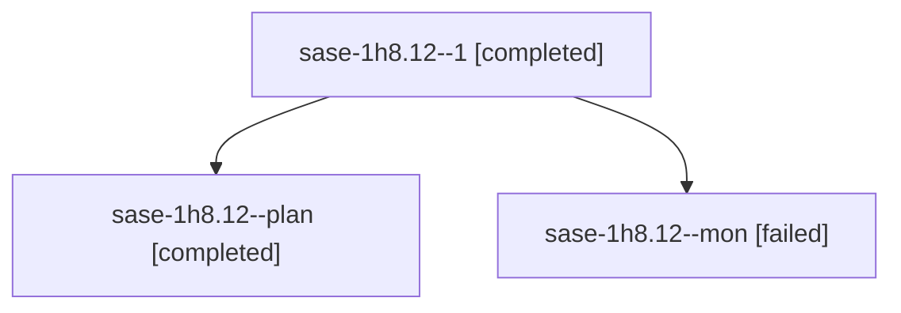

# Session: sase-1h8.12

[Agent Hoods](../README.md) / [bbugyi200](../users/bbugyi200/README.md) / [athena](../users/bbugyi200/machines/athena/README.md) / [sase-1h8](../users/bbugyi200/machines/athena/hoods/sase-1h8/README.md) / sase-1h8.12

Owner: `bbugyi200.athena` · Hood: `sase-1h8` · Members: 3 · Bead: [sase-1h8.12](https://github.com/sase-org/sase--beads/blob/main/pages/sase-1h8/sase-1h8.12.md)

## Lineage

The diagram is an optional enhancement; the ordered table below contains the same lineage in accessible text.

| Role | Agent | State | Model / provider | Timing | Commits | Prompt | Chat |
|---|---|---|---|---|---:|---|---|
| 1 | sase-1h8.12--1 | completed | muse-spark-1.3-contributor / muse | 2026-10-07T19:36:43.549445+00:00 → 2026-10-07T22:03:34.458930+00:00 | [1](../agents/bbugyi200.athena.sase-1h8.12--1/README.md#commits) | [Prompt](../agents/bbugyi200.athena.sase-1h8.12--1/prompt.md) | [Chat](../agents/bbugyi200.athena.sase-1h8.12--1/chat.md) |
| plan | sase-1h8.12--plan | completed | muse-spark-1.3-contributor / muse | 2026-10-07T17:16:06.583924+00:00 → 2026-10-07T18:42:10.357633+00:00 | 0 | [Prompt](../agents/bbugyi200.athena.sase-1h8.12--plan/prompt.md) | [Chat](../agents/bbugyi200.athena.sase-1h8.12--plan/chat.md) |
| mon | sase-1h8.12--mon | failed | muse-spark-1.3-contributor / muse | 2026-10-07T18:39:03.973910+00:00 → 2026-10-07T19:35:37.888952+00:00 | 0 | — | [Chat](../agents/bbugyi200.athena.sase-1h8.12--mon/chat.md) |

## Commits

| Role | Repo | Commit | Subject | Committed |
|---|---|---|---|---|
| 1 | sase | [`446f183`](https://github.com/sase-org/sase/commit/446f1833deb92962992f7fb9538a82a21f3c0982) | feat(bead): serve list and status queries from indexed read-model tables | 2026-10-07 16:19:41 EDT |

## Neighbors

| Agent | Relation | State |
|---|---|---|
| [sase-1h8.1](../agents/bbugyi200.athena.sase-1h8.1/README.md) | sase-1h8 hood | completed |
| [sase-1h8.10](../agents/bbugyi200.athena.sase-1h8.10/README.md) | sase-1h8 hood | completed |
| [sase-1h8.11](../agents/bbugyi200.athena.sase-1h8.11/README.md) | sase-1h8 hood | completed |
| [sase-1h8.13](bbugyi200.athena.sase-1h8.13.md) (session · 3) | sase-1h8 hood | active 2, failed 1 |
| [sase-1h8.14](../agents/bbugyi200.athena.sase-1h8.14/README.md) | sase-1h8 hood | waiting |
| [sase-1h8.2](bbugyi200.athena.sase-1h8.2.md) (session · 3) | sase-1h8 hood | completed 2, failed 1 |
| [sase-1h8.3](bbugyi200.athena.sase-1h8.3.md) (session · 3) | sase-1h8 hood | completed 2, failed 1 |
| [sase-1h8.4](../agents/bbugyi200.athena.sase-1h8.4/README.md) | sase-1h8 hood | completed |
| [sase-1h8.5](bbugyi200.athena.sase-1h8.5.md) (session · 3) | sase-1h8 hood | completed 2, failed 1 |
| [sase-1h8.6](bbugyi200.athena.sase-1h8.6.md) (session · 3) | sase-1h8 hood | completed 2, failed 1 |
| [sase-1h8.7](../agents/bbugyi200.athena.sase-1h8.7/README.md) | sase-1h8 hood | completed |
| [sase-1h8.8](bbugyi200.athena.sase-1h8.8.md) (session · 3) | sase-1h8 hood | completed 2, failed 1 |
| [sase-1h8.9](bbugyi200.athena.sase-1h8.9.md) (session · 3) | sase-1h8 hood | completed 2, failed 1 |
| [sase-1h8.land](../agents/bbugyi200.athena.sase-1h8.land/README.md) | sase-1h8 hood | waiting |
