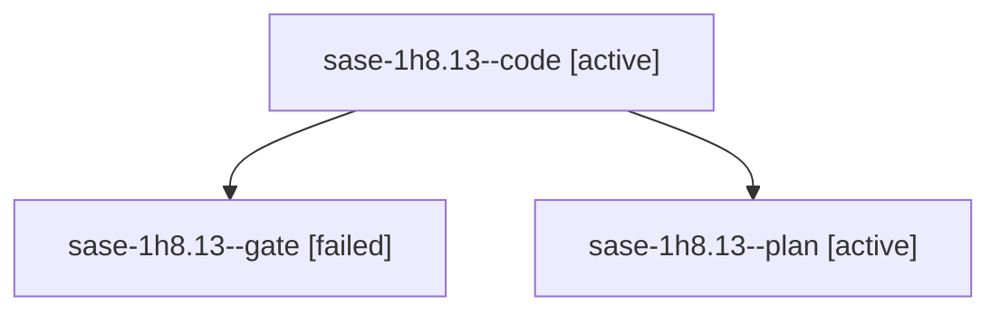

# Session: sase-1h8.13

[Agent Hoods](../README.md) / [bbugyi200](../users/bbugyi200/README.md) / [athena](../users/bbugyi200/machines/athena/README.md) / [sase-1h8](../users/bbugyi200/machines/athena/hoods/sase-1h8/README.md) / sase-1h8.13

Owner: `bbugyi200.athena` · Hood: `sase-1h8` · Members: 3 · Bead: [sase-1h8.13](https://github.com/sase-org/sase--beads/blob/main/pages/sase-1h8/sase-1h8.13.md)

## Lineage

The diagram is an optional enhancement; the ordered table below contains the same lineage in accessible text.

| Role | Agent | State | Model / provider | Timing | Commits | Prompt | Chat |
|---|---|---|---|---|---:|---|---|
| code | sase-1h8.13--code | active | muse-spark-1.3-contributor / muse | 2026-10-07T22:14:09.239029+00:00 | 0 | — | — |
| gate | sase-1h8.13--gate | failed | gpt-6.1-sol / codex | 2026-10-07T22:12:12.062286+00:00 → 2026-10-07T22:12:58.624273+00:00 | 0 | — | [Chat](../agents/bbugyi200.athena.sase-1h8.13--gate/chat.md) |
| plan | sase-1h8.13--plan | active | gpt-6.1-sol / codex | 2026-10-07T22:03:26.230959+00:00 | 0 | [Prompt](../agents/bbugyi200.athena.sase-1h8.13--plan/prompt.md) | [Chat](../agents/bbugyi200.athena.sase-1h8.13--plan/chat.md) |

## Neighbors

| Agent | Relation | State |
|---|---|---|
| [sase-1h8.1](../agents/bbugyi200.athena.sase-1h8.1/README.md) | sase-1h8 hood | completed |
| [sase-1h8.10](../agents/bbugyi200.athena.sase-1h8.10/README.md) | sase-1h8 hood | completed |
| [sase-1h8.11](../agents/bbugyi200.athena.sase-1h8.11/README.md) | sase-1h8 hood | completed |
| [sase-1h8.12](bbugyi200.athena.sase-1h8.12.md) (session · 3) | sase-1h8 hood | completed 2, failed 1 |
| [sase-1h8.14](../agents/bbugyi200.athena.sase-1h8.14/README.md) | sase-1h8 hood | waiting |
| [sase-1h8.2](bbugyi200.athena.sase-1h8.2.md) (session · 3) | sase-1h8 hood | completed 2, failed 1 |
| [sase-1h8.3](bbugyi200.athena.sase-1h8.3.md) (session · 3) | sase-1h8 hood | completed 2, failed 1 |
| [sase-1h8.4](../agents/bbugyi200.athena.sase-1h8.4/README.md) | sase-1h8 hood | completed |
| [sase-1h8.5](bbugyi200.athena.sase-1h8.5.md) (session · 3) | sase-1h8 hood | completed 2, failed 1 |
| [sase-1h8.6](bbugyi200.athena.sase-1h8.6.md) (session · 3) | sase-1h8 hood | completed 2, failed 1 |
| [sase-1h8.7](../agents/bbugyi200.athena.sase-1h8.7/README.md) | sase-1h8 hood | completed |
| [sase-1h8.8](bbugyi200.athena.sase-1h8.8.md) (session · 3) | sase-1h8 hood | completed 2, failed 1 |
| [sase-1h8.9](bbugyi200.athena.sase-1h8.9.md) (session · 3) | sase-1h8 hood | completed 2, failed 1 |
| [sase-1h8.land](../agents/bbugyi200.athena.sase-1h8.land/README.md) | sase-1h8 hood | waiting |
