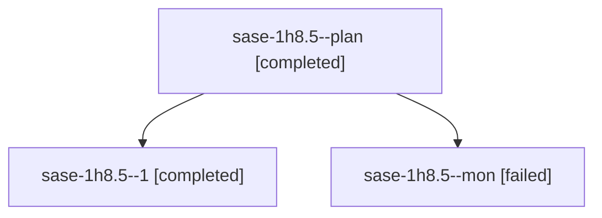

# Session: sase-1h8.5

[Agent Hoods](../README.md) / [bbugyi200](../users/bbugyi200/README.md) / [athena](../users/bbugyi200/machines/athena/README.md) / [sase-1h8](../users/bbugyi200/machines/athena/hoods/sase-1h8/README.md) / sase-1h8.5

Owner: `bbugyi200.athena` · Hood: `sase-1h8` · Members: 3 · Bead: [sase-1h8.5](https://github.com/sase-org/sase--beads/blob/main/pages/sase-1h8/sase-1h8.5.md)

## Lineage

The diagram is an optional enhancement; the ordered table below contains the same lineage in accessible text.

| Role | Agent | State | Model / provider | Timing | Commits | Prompt | Chat |
|---|---|---|---|---|---:|---|---|
| plan | sase-1h8.5--plan | completed | muse-spark-1.3-contributor / muse | 2026-10-06T23:04:09.921252+00:00 → 2026-10-06T23:40:08.661748+00:00 | 0 | [Prompt](../agents/bbugyi200.athena.sase-1h8.5--plan/prompt.md) | [Chat](../agents/bbugyi200.athena.sase-1h8.5--plan/chat.md) |
| 1 | sase-1h8.5--1 | completed | muse-spark-1.3-contributor / muse | 2026-10-06T23:46:09.245325+00:00 → 2026-10-06T23:59:20.417254+00:00 | [1](../agents/bbugyi200.athena.sase-1h8.5--1/README.md#commits) | [Prompt](../agents/bbugyi200.athena.sase-1h8.5--1/prompt.md) | [Chat](../agents/bbugyi200.athena.sase-1h8.5--1/chat.md) |
| mon | sase-1h8.5--mon | failed | muse-spark-1.3-contributor / muse | 2026-10-06T23:38:58.538742+00:00 → 2026-10-06T23:45:32.296890+00:00 | 0 | — | [Chat](../agents/bbugyi200.athena.sase-1h8.5--mon/chat.md) |

## Commits

| Role | Repo | Commit | Subject | Committed |
|---|---|---|---|---|
| 1 | sase | [`4a7ffac`](https://github.com/sase-org/sase/commit/4a7ffacb6c11c98b6203bb190391fa46b9739558) | feat(bead-store): add bead\_store\_fingerprint binding and migrate five consumers | 2026-10-06 19:55:09 EDT |

## Neighbors

| Agent | Relation | State |
|---|---|---|
| [sase-1h8.1](../agents/bbugyi200.athena.sase-1h8.1/README.md) | sase-1h8 hood | completed |
| [sase-1h8.10](../agents/bbugyi200.athena.sase-1h8.10/README.md) | sase-1h8 hood | completed |
| [sase-1h8.11](../agents/bbugyi200.athena.sase-1h8.11/README.md) | sase-1h8 hood | completed |
| [sase-1h8.12](bbugyi200.athena.sase-1h8.12.md) (session · 3) | sase-1h8 hood | completed 2, failed 1 |
| [sase-1h8.13](bbugyi200.athena.sase-1h8.13.md) (session · 3) | sase-1h8 hood | active 2, failed 1 |
| [sase-1h8.14](../agents/bbugyi200.athena.sase-1h8.14/README.md) | sase-1h8 hood | waiting |
| [sase-1h8.2](bbugyi200.athena.sase-1h8.2.md) (session · 3) | sase-1h8 hood | completed 2, failed 1 |
| [sase-1h8.3](bbugyi200.athena.sase-1h8.3.md) (session · 3) | sase-1h8 hood | completed 2, failed 1 |
| [sase-1h8.4](../agents/bbugyi200.athena.sase-1h8.4/README.md) | sase-1h8 hood | completed |
| [sase-1h8.6](bbugyi200.athena.sase-1h8.6.md) (session · 3) | sase-1h8 hood | completed 2, failed 1 |
| [sase-1h8.7](../agents/bbugyi200.athena.sase-1h8.7/README.md) | sase-1h8 hood | completed |
| [sase-1h8.8](bbugyi200.athena.sase-1h8.8.md) (session · 3) | sase-1h8 hood | completed 2, failed 1 |
| [sase-1h8.9](bbugyi200.athena.sase-1h8.9.md) (session · 3) | sase-1h8 hood | completed 2, failed 1 |
| [sase-1h8.land](../agents/bbugyi200.athena.sase-1h8.land/README.md) | sase-1h8 hood | waiting |
