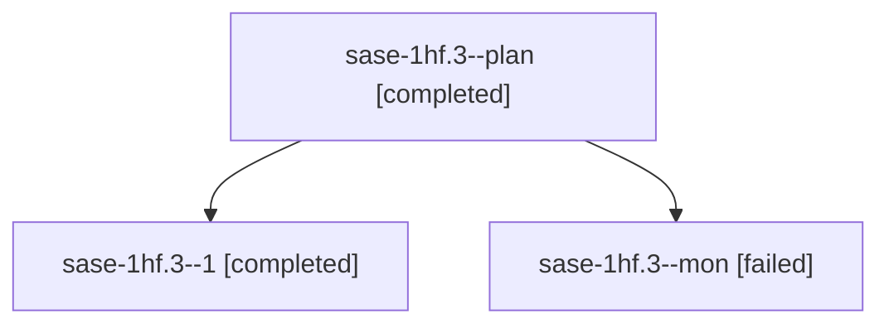

# Session: sase-1hf.3

[Agent Hoods](../README.md) / [bbugyi200](../users/bbugyi200/README.md) / [athena](../users/bbugyi200/machines/athena/README.md) / [sase-1hf](../users/bbugyi200/machines/athena/hoods/sase-1hf/README.md) / sase-1hf.3

Owner: `bbugyi200.athena` · Hood: `sase-1hf` · Members: 3 · Bead: [sase-1hf.3](https://github.com/sase-org/sase--beads/blob/main/pages/sase-1hf/sase-1hf.3.md)

## Lineage

The diagram is an optional enhancement; the ordered table below contains the same lineage in accessible text.

| Role | Agent | State | Model / provider | Timing | Commits | Prompt | Chat |
|---|---|---|---|---|---:|---|---|
| plan | sase-1hf.3--plan | completed | muse-spark-1.3-contributor / muse | 2026-10-07T19:42:45.859591+00:00 → 2026-10-07T20:11:28.812385+00:00 | 0 | [Prompt](../agents/bbugyi200.athena.sase-1hf.3--plan/prompt.md) | [Chat](../agents/bbugyi200.athena.sase-1hf.3--plan/chat.md) |
| 1 | sase-1hf.3--1 | completed | muse-spark-1.3-contributor / muse | 2026-10-07T20:23:17.048640+00:00 → 2026-10-07T21:35:53.405057+00:00 | [1](../agents/bbugyi200.athena.sase-1hf.3--1/README.md#commits) | [Prompt](../agents/bbugyi200.athena.sase-1hf.3--1/prompt.md) | [Chat](../agents/bbugyi200.athena.sase-1hf.3--1/chat.md) |
| mon | sase-1hf.3--mon | failed | muse-spark-1.3-contributor / muse | 2026-10-07T20:11:00.029938+00:00 → 2026-10-07T20:20:13.711040+00:00 | 0 | — | [Chat](../agents/bbugyi200.athena.sase-1hf.3--mon/chat.md) |

## Commits

| Role | Repo | Commit | Subject | Committed |
|---|---|---|---|---|
| 1 | sase | [`62604c1`](https://github.com/sase-org/sase/commit/62604c10b7b01af1dd28cd43404d6728c2c3a375) | feat(wait): add release telemetry for wait dependency resolution | 2026-10-07 17:28:12 EDT |

## Neighbors

| Agent | Relation | State |
|---|---|---|
| [sase-1hf.1](../agents/bbugyi200.athena.sase-1hf.1/README.md) | sase-1hf hood | completed |
| [sase-1hf.2](../agents/bbugyi200.athena.sase-1hf.2/README.md) | sase-1hf hood | completed |
| [sase-1hf.4](../agents/bbugyi200.athena.sase-1hf.4/README.md) | sase-1hf hood | completed |
| [sase-1hf.5](../agents/bbugyi200.athena.sase-1hf.5/README.md) | sase-1hf hood | active |
| [sase-1hf.land](../agents/bbugyi200.athena.sase-1hf.land/README.md) | sase-1hf hood | waiting |
