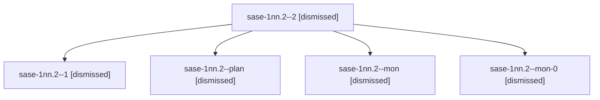

# Session: sase-1nn.2

[Agent Hoods](../README.md) / [bbugyi200](../users/bbugyi200/README.md) / [athena](../users/bbugyi200/machines/athena/README.md) / [sase-1nn](../users/bbugyi200/machines/athena/hoods/sase-1nn/README.md) / sase-1nn.2

Owner: `bbugyi200.athena` · Hood: `sase-1nn` · Members: 5 · Bead: [sase-1nn.2](https://github.com/sase-org/sase--beads/blob/main/pages/sase-1nn/sase-1nn.2.md)

## Lineage

```mermaid
flowchart TD
  n0["sase-1nn.2--2 [dismissed]"]
  n1["sase-1nn.2--1 [dismissed]"]
  n0 --> n1
  n2["sase-1nn.2--plan [dismissed]"]
  n0 --> n2
  n3["sase-1nn.2--mon [dismissed]"]
  n0 --> n3
  n4["sase-1nn.2--mon-0 [dismissed]"]
  n0 --> n4
```

The diagram is an optional enhancement; the ordered table below contains the same lineage in accessible text.

| Role | Agent | State | Model / provider | Timing | Commits | Prompt | Chat |
|---|---|---|---|---|---:|---|---|
| 2 | sase-1nn.2--2 | dismissed | muse-spark-1.3-contributor / muse | 2026-10-23T13:46:56.721422 → 2026-10-23T13:55:44.828571 | [1](../agents/bbugyi200.athena.sase-1nn.2--2/README.md#commits) | [Prompt](../agents/bbugyi200.athena.sase-1nn.2--2/prompt.md) | [Chat](../agents/bbugyi200.athena.sase-1nn.2--2/chat.md) |
| 1 | sase-1nn.2--1 | dismissed | muse-spark-1.3-contributor / muse | 2026-10-23T13:15:37.458523 → 2026-10-23T13:29:57.038581 | 0 | [Prompt](../agents/bbugyi200.athena.sase-1nn.2--1/prompt.md) | [Chat](../agents/bbugyi200.athena.sase-1nn.2--1/chat.md) |
| plan | sase-1nn.2--plan | dismissed | muse-spark-1.3-contributor / muse | 2026-10-23T12:02:50.240951 → 2026-10-23T12:08:19.134389 | 0 | [Prompt](../agents/bbugyi200.athena.sase-1nn.2--plan/prompt.md) | [Chat](../agents/bbugyi200.athena.sase-1nn.2--plan/chat.md) |
| mon | sase-1nn.2--mon | dismissed | muse-spark-1.3-contributor / muse | 2026-10-23T12:07:15.065801 → 2026-10-23T13:12:28.715396 | 0 | — | [Chat](../agents/bbugyi200.athena.sase-1nn.2--mon/chat.md) |
| mon-0 | sase-1nn.2--mon-0 | dismissed | muse-spark-1.3-contributor / muse | 2026-10-23T13:27:55.333455 → 2026-10-23T13:42:42.397962 | 0 | — | [Chat](../agents/bbugyi200.athena.sase-1nn.2--mon-0/chat.md) |

## Commits

| Role | Repo | Commit | Subject | Committed |
|---|---|---|---|---|
| 2 | — | `b97e6c4` | chore(core): raise sase-core-rs pin 0.42.0 to 0.42.2 | 2026-10-23 13:51:54 EDT |

## Neighbors

| Agent | Relation | State |
|---|---|---|
| [sase-1nn.1](../agents/bbugyi200.athena.sase-1nn.1/README.md) | sase-1nn hood | dismissed |
| [sase-1nn.3](bbugyi200.athena.sase-1nn.3.md) (session · 3) | sase-1nn hood | dismissed 3 |
| [sase-1nn.4](../agents/bbugyi200.athena.sase-1nn.4/README.md) | sase-1nn hood | dismissed |
| [sase-1nn.5](bbugyi200.athena.sase-1nn.5.md) (session · 15) | sase-1nn hood | dismissed 15 |
| [sase-1nn.6](../agents/bbugyi200.athena.sase-1nn.6/README.md) | sase-1nn hood | dismissed |
| [sase-1nn.7](bbugyi200.athena.sase-1nn.7.md) (session · 2) | sase-1nn hood | dismissed 2 |
| [sase-1nn.8.1](../agents/bbugyi200.athena.sase-1nn.8.1/README.md) | sase-1nn hood | dismissed |
| [sase-1nn.8.2](bbugyi200.athena.sase-1nn.8.2.md) (session · 5) | sase-1nn hood | dismissed 5 |
| [sase-1nn.8.3](bbugyi200.athena.sase-1nn.8.3.md) (session · 2) | sase-1nn hood | dismissed 2 |
| [sase-1nn.8.4.1](bbugyi200.athena.sase-1nn.8.4.1.md) (session · 3) | sase-1nn hood | dismissed 3 |
| [sase-1nn.8.4.2](bbugyi200.athena.sase-1nn.8.4.2.md) (session · 2) | sase-1nn hood | dismissed 2 |
| [sase-1nn.8.4.3.1](bbugyi200.athena.sase-1nn.8.4.3.1.md) (session · 3) | sase-1nn hood | dismissed 3 |
| [sase-1nn.8.4.3.2](../agents/bbugyi200.athena.sase-1nn.8.4.3.2/README.md) | sase-1nn hood | dismissed |
| [sase-1nn.8.4.3.3](bbugyi200.athena.sase-1nn.8.4.3.3.md) (session · 3) | sase-1nn hood | dismissed 3 |
| [sase-1nn.8.4.3.4](bbugyi200.athena.sase-1nn.8.4.3.4.md) (session · 2) | sase-1nn hood | dismissed 2 |
| [sase-1nn.8.4.3.5.1](bbugyi200.athena.sase-1nn.8.4.3.5.1.md) (session · 3) | sase-1nn hood | dismissed 3 |
| [sase-1nn.8.4.3.5.2](../agents/bbugyi200.athena.sase-1nn.8.4.3.5.2/README.md) | sase-1nn hood | dismissed |
| [sase-1nn.8.4.3.5.3](bbugyi200.athena.sase-1nn.8.4.3.5.3.md) (session · 2) | sase-1nn hood | dismissed 2 |
| [sase-1nn.8.4.3.5.4.1](../agents/bbugyi200.athena.sase-1nn.8.4.3.5.4.1/README.md) | sase-1nn hood | completed |
| [sase-1nn.8.4.3.5.4.2](bbugyi200.athena.sase-1nn.8.4.3.5.4.2.md) (session · 2) | sase-1nn hood | completed 1, failed 1 |
| [sase-1nn.8.4.3.5.4.land](bbugyi200.athena.sase-1nn.8.4.3.5.4.land.md) (session · 3) | sase-1nn hood | completed 2, failed 1 |
| [sase-1nn.8.4.3.5.land](bbugyi200.athena.sase-1nn.8.4.3.5.land.md) (session · 3) | sase-1nn hood | dismissed 3 |
| [sase-1nn.8.4.3.land](bbugyi200.athena.sase-1nn.8.4.3.land.md) (session · 3) | sase-1nn hood | dismissed 3 |
| [sase-1nn.8.4.land](bbugyi200.athena.sase-1nn.8.4.land.md) (session · 13) | sase-1nn hood | completed 1, dismissed 11, failed 1 |
| [sase-1nn.8.land](bbugyi200.athena.sase-1nn.8.land.md) (session · 3) | sase-1nn hood | dismissed 3 |
| [sase-1nn.land](bbugyi200.athena.sase-1nn.land.md) (session · 3) | sase-1nn hood | dismissed 3 |
