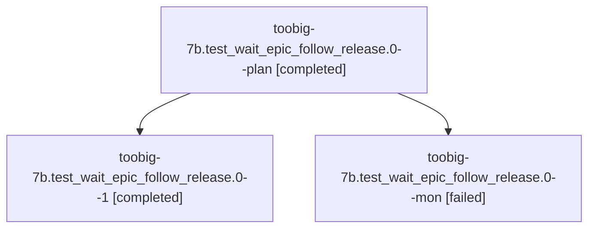

# Session: toobig-7b.test\_wait\_epic\_follow\_release.0

[Agent Hoods](../README.md) / [bbugyi200](../users/bbugyi200/README.md) / [athena](../users/bbugyi200/machines/athena/README.md) / [toobig-7b](../users/bbugyi200/machines/athena/hoods/toobig-7b/README.md) / toobig-7b.test\_wait\_epic\_follow\_release.0

Owner: `bbugyi200.athena` · Hood: `toobig-7b` · Members: 3

## Lineage

The diagram is an optional enhancement; the ordered table below contains the same lineage in accessible text.

| Role | Agent | State | Model / provider | Timing | Commits | Prompt | Chat |
|---|---|---|---|---|---:|---|---|
| plan | toobig-7b.test\_wait\_epic\_follow\_release.0--plan | completed | muse-spark-1.3-contributor / muse | 2026-10-07T23:15:57.474878+00:00 → 2026-10-07T23:52:07.163709+00:00 | 0 | [Prompt](../agents/bbugyi200.athena.toobig-7b.test_wait_epic_follow_release.0--plan/prompt.md) | [Chat](../agents/bbugyi200.athena.toobig-7b.test_wait_epic_follow_release.0--plan/chat.md) |
| 1 | toobig-7b.test\_wait\_epic\_follow\_release.0--1 | completed | muse-spark-1.3-contributor / muse | 2026-10-08T00:55:35.753411+00:00 → 2026-10-08T01:28:40.077891+00:00 | [1](../agents/bbugyi200.athena.toobig-7b.test_wait_epic_follow_release.0--1/README.md#commits) | [Prompt](../agents/bbugyi200.athena.toobig-7b.test_wait_epic_follow_release.0--1/prompt.md) | [Chat](../agents/bbugyi200.athena.toobig-7b.test_wait_epic_follow_release.0--1/chat.md) |
| mon | toobig-7b.test\_wait\_epic\_follow\_release.0--mon | failed | muse-spark-1.3-contributor / muse | 2026-10-07T23:51:01.982314+00:00 → 2026-10-08T00:53:28.463057+00:00 | 0 | — | [Chat](../agents/bbugyi200.athena.toobig-7b.test_wait_epic_follow_release.0--mon/chat.md) |

## Commits

| Role | Repo | Commit | Subject | Committed |
|---|---|---|---|---|
| 1 | sase | [`2f4d5f9`](https://github.com/sase-org/sase/commit/2f4d5f9bb0ee419f89a669e24ed9f229c06d486d) | test(wait-epic): split follow-release regressions into focused modules | 2026-10-07 21:24:15 EDT |

## Neighbors

| Agent | Relation | State |
|---|---|---|
| [toobig-7b.agent\_scan\_wire\_markers.0](bbugyi200.athena.toobig-7b.agent_scan_wire_markers.0.md) (session · 3) | toobig-7b hood | completed 2, failed 1 |
| [toobig-7b.test\_continuation\_replay\_hydration.0](../agents/bbugyi200.athena.toobig-7b.test_continuation_replay_hydration.0/README.md) | toobig-7b hood | completed |
